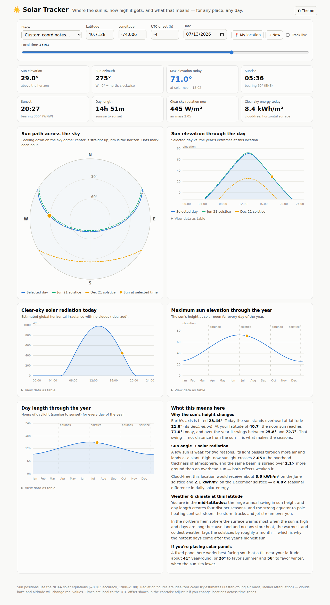

# ☀️ Solar Tracker

A fast, friendly web app that shows **where the sun is in the sky, how high it
gets, and what that means** — for your location or any place on Earth, on any
day of the year.

No accounts, no build step, no dependencies: open one HTML file and go.



## What it shows

- **Sun position right now (or any moment)** — elevation and azimuth, with a
  live "track" mode that follows the real sun.
- **Maximum inclination** — the sun's height at solar noon for the selected
  day, and a full-year chart of the noon maximum for every day of the year.
- **Sun path across the sky** — a polar sky-dome diagram of the day's path,
  with the June and December solstice paths for comparison and dots marking
  each hour.
- **Sunrise, sunset, solar noon and day length** — including the compass
  bearing of sunrise/sunset, plus a day-length-through-the-year chart. Polar
  day and polar night are handled correctly.
- **Solar radiation** — idealized clear-sky irradiance (W/m²) through the day,
  total cloud-free energy for the day (kWh/m²), and the current air mass.
- **What it means** — plain-language, location-aware explanations of how sun
  angle drives the seasons, solar radiation, weather and climate at your
  latitude, and a suggested solar-panel tilt.
- **City search** — type any city name to jump there; powered by the free
  Open-Meteo geocoding API (with DST-correct time zones), falling back to a
  built-in city list when offline.
- **✨ Scenic mode** — an ambient sky panel whose colors track the sun through
  night, twilight, golden hour and day, with a landscape that changes with the
  season at your hemisphere (snow in winter, autumn golds, tropical greens…).
  Your location, theme and scenic preference are remembered between visits.

Every chart has hover tooltips (mouse or keyboard arrows), a data-table view,
and full light/dark theming.

## Using it

```bash
# from the repo root — any static server works
python3 -m http.server 8000
# then open http://localhost:8000
```

Opening `index.html` directly also works in browsers that allow ES modules
from `file://` — if yours doesn't, use the one-liner above.

- **📍 My location** uses browser geolocation (needs HTTPS or localhost).
- **Search city** finds any place by name and sets its time zone automatically.
- For **custom coordinates**, set the UTC offset yourself — the app shows a
  suggested offset estimated from the longitude.
- Drag the **time slider** to scrub through the day; **⏱ Now** jumps to the
  current moment; **Track live** keeps following the real sun.

## Accuracy

- Sun positions use the **NOAA solar calculator equations** (Meeus,
  *Astronomical Algorithms*): about **0.01° accuracy for 1900–2100**, verified
  in the test suite against the NREL SPA benchmark case.
- Sunrise/sunset use the standard 90.833° zenith (refraction + solar disc).
- Radiation numbers are **idealized clear-sky estimates** (Kasten–Young air
  mass, Meinel/ASCE attenuation). Clouds, haze, altitude and horizon obstacles
  will change real-world values — treat them as a cloud-free upper bound.

## Project layout

```
index.html        page structure
css/style.css     theme tokens (light/dark) and layout
js/solar.js       astronomy: sun position, rise/set, air mass, irradiance
js/charts.js      dependency-free SVG charts (line + polar sky dome)
js/scene.js       scenic mode: sky palette, seasons, landscape renderer
js/app.js         UI state, city search, geolocation, explanations
tests/            node:test suite for the astronomy math
```

## Tests

```bash
node --test tests/solar.test.mjs
```

14 tests cover Julian-day epochs, solstice/equinox declinations, the NREL SPA
reference position, polar day/night, day-length symmetry, air mass and
clear-sky insolation sanity checks.
