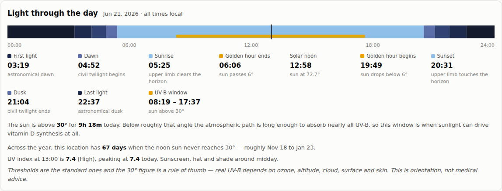

# ☀️ Solar Tracker

A fast, friendly web app that shows **where the sun is in the sky, how high it
gets, and what that means** — for your location or any place on Earth, on any
day of the year.

No accounts, no build step, no dependencies: open one HTML file and go.



## What it shows

- **Sun position right now (or any moment)** — elevation and azimuth, with a
  live "track" mode that follows the real sun.
- **Maximum inclination** — the sun's height at solar noon for the selected
  day, and a full-year chart of the noon maximum for every day of the year.
- **Sun path across the sky** — a polar sky-dome diagram of the day's path,
  with the June and December solstice paths for comparison and dots marking
  each hour.
- **Sunrise, sunset, solar noon and day length** — including the compass
  bearing of sunrise/sunset, plus a day-length-through-the-year chart. Polar
  day and polar night are handled correctly.
- **Solar radiation** — idealized clear-sky irradiance (W/m²) through the day,
  total cloud-free energy for the day (kWh/m²), and the current air mass.
- **What it means** — plain-language, location-aware explanations of how sun
  angle drives the seasons, solar radiation, weather and climate at your
  latitude, and a suggested solar-panel tilt.
- **City search** — type any city name to jump there; powered by the free
  Open-Meteo geocoding API (with DST-correct time zones), falling back to a
  built-in city list when offline.
- **⇄ Compare two dates** — pick a second date and the app puts them side by
  side: an annotated Earth schematic for each (sunlight from the left, the
  terminator, the tilted axis, your latitude's lit and dark arcs, and the noon
  sun angle drawn at your position), a delta readout for noon elevation,
  daylight, clear-sky energy and declination, and a to-scale orbit inset that
  shows why the 3% change in sun distance is *not* what makes the difference.
  The day charts and sky dome overlay both dates too.
- **🌦️ Weather** — real conditions for the selected place and date, from the
  free Open-Meteo API. Temperature, cloud cover, precipitation, wind and
  sunshine hours, plus the number this app cares about most: the **actual**
  solar energy the sky delivered against the clear-sky ceiling it computes.
  The radiation chart plots both curves, so the gap between them *is* what the
  clouds took. Forecasts run 15 days ahead and the reanalysis archive reaches
  back to 1940; outside that window the app says so rather than guessing.
- **✨ Scenic mode** — an ambient sky panel whose colors track the sun through
  night, twilight, golden hour and day, with a landscape that changes with the
  season at your hemisphere (snow in winter, autumn golds, tropical greens…).
  Trees on the hillside are grown from a recursive branching structure — a
  trunk forking into limbs and twigs, different for every tree but stable
  across renders — and they carry the season: blossom in spring, full green in
  summer, gold with fallen leaves in autumn, bare snow-dusted branches in
  winter, palms in the tropics. They also **cast real shadows**: length is the
  true `height / tan(elevation)`, sweeping from long and westward at sunrise,
  to a tight pool at solar noon, to long and eastward at sunset. Your location,
  theme and scenic preference are remembered between visits. With weather
  loaded the panel follows the real sky too: clouds build with the cover
  percentage, the sky greys and the sun fades behind them, shadows soften and
  go as cloud takes the direct beam, and rain or snow falls when it is falling.

Every chart has hover tooltips (mouse or keyboard arrows), a data-table view,
and full light/dark theming.

## Using it

```bash
# from the repo root — any static server works
python3 -m http.server 8000
# then open http://localhost:8000
```

Opening `index.html` directly also works in browsers that allow ES modules
from `file://` — if yours doesn't, use the one-liner above.

- **📍 My location** uses browser geolocation (needs HTTPS or localhost).
- **Search city** finds any place by name and sets its time zone automatically.
- For **custom coordinates**, set the UTC offset yourself — the app shows a
  suggested offset estimated from the longitude.
- Drag the **time slider** to scrub through the day; **⏱ Now** jumps to the
  current moment; **Track live** keeps following the real sun.

## Version badge

The header shows the running version (currently `v1.4.0`); hovering it reveals
the build date. Use it to confirm a deploy actually took effect — if the badge
still shows the previous version, the browser or CDN is serving a cached build
(GitHub Pages caches assets for roughly ten minutes; a hard refresh clears it).
The version is also on `window.SOLAR_TRACKER_VERSION` for a quick console check.

To release, bump `VERSION` and `BUILD_DATE` together in `js/version.js` — that
file is the single source of truth.

## Accuracy

- Sun positions use the **NOAA solar calculator equations** (Meeus,
  *Astronomical Algorithms*): about **0.01° accuracy for 1900–2100**, verified
  in the test suite against the NREL SPA benchmark case.
- Sunrise/sunset use the standard 90.833° zenith (refraction + solar disc).
- Radiation numbers computed here are **idealized clear-sky estimates**
  (Kasten–Young air mass, Meinel/ASCE attenuation): a cloud-free upper bound,
  unaffected by haze, altitude or a blocked horizon.
- **Actual** radiation comes from Open-Meteo's model rather than from that
  estimate, which is why the two curves can be compared honestly. Where a
  provider returns no radiation, cloud cover is converted with the
  Kasten–Czeplak (1980) relation `1 − 0.75·(N/8)^3.4` instead.
- Weather is a forecast for future dates and a reanalysis for past ones —
  neither is a station observation at your exact spot.

## Project layout

```
index.html        page structure
css/style.css     theme tokens (light/dark) and layout
js/solar.js       astronomy: sun position, rise/set, air mass, irradiance
js/charts.js      dependency-free SVG charts (line + polar sky dome)
js/scene.js       scenic mode: sky palette, seasons, landscape renderer
js/orbit.js       comparison schematics: Earth geometry + to-scale orbit
js/version.js     version + build date shown in the header badge
js/weather.js     Open-Meteo forecast/archive fetch + cloud attenuation
js/app.js         UI state, city search, geolocation, explanations
tests/            node:test suite for the astronomy math
```

## Tests

```bash
node --test tests/*.mjs
```

46 tests cover Julian-day epochs, solstice/equinox declinations, the NREL SPA
reference position, polar day/night, day-length symmetry, air mass and
clear-sky insolation sanity checks, the scenic sky palette and hemisphere
seasons, and the comparison schematic's geometry — including a cross-check
that the lit/dark split drawn on each globe always agrees with the
independently computed day length, and that the orbit inset reproduces
perihelion in early January and aphelion in early July, plus a check that the
version string is well formed and the header badge element exists. Six cover
the scenic shadow geometry: length equal to `height / tan(elevation)`, the
morning/afternoon mirror about noon, the foreshortened toward-viewer shadow at
solar noon, the hemisphere flip, the long-shadow cap, and no shadow at all once
the sun is below the horizon. Three more cover the branch generator: that it
is deterministic, that bigger trees carry more branches than distant ones, and
that a crown stays taller than it is wide. Nine more cover weather: the WMO
code table, the Kasten–Czeplak curve and its clamping, whole-day offsets across
month ends, which endpoint serves which date range (including the exact
forecast horizon), pulling a single local day out of a payload without bleed
from the next one, and summarising a day both with and without provider
radiation.
